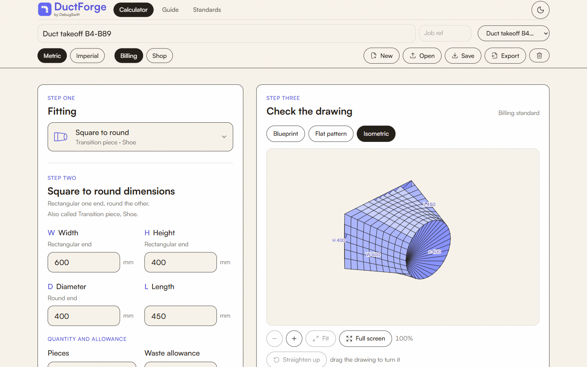
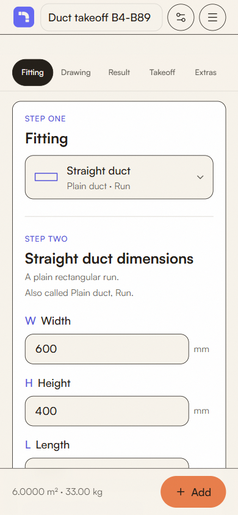

# DuctForge

**HVAC ductwork takeoff and sheet-metal calculator.** Enter a fitting's dimensions and get its surface area, GI sheet weight, SMACNA gauge and a bill of materials you can export.

**Live:** https://ductforge.debugswift.com · free, no sign-up, works offline once installed

## What it covers

- **Ten fittings:** straight duct, transition, elbow, offset, collar and Y-piece in rectangular, plus round duct, gored round elbow, concentric cone and square-to-round
- **Eight flat pieces:** rectangle, circle, ring, holed plate, frame, flat oval, triangle and trapezoid
- **Two measuring standards:** commercial billing (what goes on an invoice) and shop fabrication (the true unfolded blank a fabricator cuts)
- **Three drawings of every fitting:** a dimensioned blueprint, a flat pattern with cut and fold lines, and an isometric view you can turn
- **Beyond the sheet:** insulation area, flanges, hangers, zones, extras (dampers, grilles, labour), and your own rates per kg or per m²
- **Metric or imperial,** switchable at any time with no rounding
- **A printable takeoff sheet,** every part switchable, previewed live and saved as PDF

Takeoffs stay on your device. Nothing is uploaded.

## Documentation

- **[How to take off a duct job](docs/guide.md):** the workflow, step by step
- **[Standards, formulas and constants](docs/standards.md):** every formula for both standards, the gauge table, materials, allowances, and what each one simplifies
- **[Changelog](CHANGELOG.md):** what changed, and when

The guide is also live in [English](https://ductforge.debugswift.com/guide), [বাংলা](https://ductforge.debugswift.com/guide/bn) and [हिन्दी](https://ductforge.debugswift.com/guide/hi).

## Found a wrong number?

[Report it here](../../issues/new/choose). A wrong result is the most useful thing you can send. Please include the dimensions you typed.

## Source code

DuctForge's source is private. This repository is its public home: documentation, changelog and issue tracker.

Built by [DebugSwift](https://debugswift.com).
